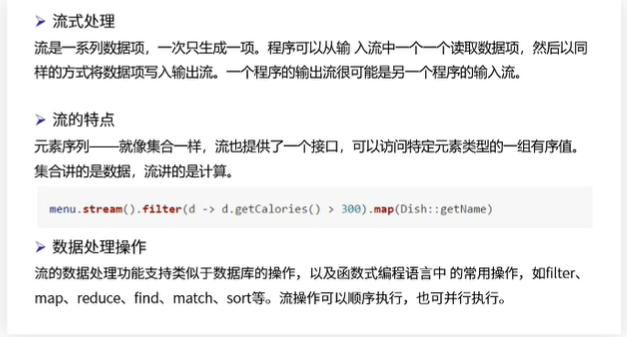

## 我看underscore 源码设计

先过滤掉underscore内部各个工具函数的具体逻辑，只看源码库本身有什么内容。

### 构造函数

underscore有两种调用方式：

1. 风格对象 `_.map([1, 2, 3], function(n){ return n * 2; });`
2. 函数风格`_([1, 2, 3]).map(function(n){ return n * 2; });`

`_`是一个函数对象，api中的函数全都挂载到`_`上，实现`_.func`

```javascript
// 使用立即执行函数
(function () {
      // 定义全局对象
      var root = typeof self == 'object' && self.self === self && self ||
            typeof global == 'object' && global.global === global && global ||
            this ||
            {};
     // 省略...
     // 创建_对象
     var _ = function(obj) {
        // 如果参数是underscore的一个实例，就直接返回该参数  
    	if (obj instanceof _) return obj;
        //  对应_(xxx)调用，如果new实例不是_的实例，就返回实例化_对象
    	if (!(this instanceof _)) return new _(obj);
        // 并将数据对象包装在实例对象上 
   		this._wrapped = obj;
  	 };
     // 省略...
     
     //注册在全局对象
     root._=_; 
    
})();    
```

### mixin

上一步中，我们创建了underscore实例，只能支持`_.func`调用，如果要支持`_(obj).func`，同时还要将`func`注册在实例的`prototype`上。试想下，如果每声明一个函数，就要绑定一次，那得用多…

在underscore中，使用`mixin`将自定义函数添加到Underscore对象。

```javascript
// 用于返回排序后的数组，包含所有的obj中的函数名。
_.functions = _.methods = function(obj) {
    var names = [];
    for (var key in obj) {
      if (_.isFunction(obj[key])) names.push(key);
    }
    return names.sort();
};
_.mixin = function(obj) {
    // 遍历obj的函数，绑定在原型上
    _.each(_.functions(obj), function(name) {  
      var func = _[name] = obj[name];
      _.prototype[name] = function() {
        // this._wrapped作为第一个参数传递，其他用户传递的参数放在后面。  
        var args = [this._wrapped];
        push.apply(args, arguments);
        return chainResult(this, func.apply(_, args));
      };
    });
    return _;
};
// 执行混入
 _.mixin(_);
```

大致流程是：

1. 获取当前实例上注册的函数数组
2. 遍历数组将函数注册在实例原型上
3. 将`_(args).func(argument)`参数进行合并

`_`自身定义一系列函数，通过`_.mixin()`绑定在了`_.prototype`上，提高了代码的复用度。

### 链式调用

类似于 Java Stream 流式编程

 

在Javascript中，数据可以像是在管道中流通，我们称之为，**声明式编程/链接式调用**。

```javascript
data.filter(...).unique(...).map(...)
```

既然要满足链接式调用（Chaining）语法，需要满足两个条件

1. 前一次调用返回数据对象，用来给下一个函数调用提供数据来源
2. 返回调用当前函数的对象，以保证可以调用下个函数

可能会想到，在每个函数结尾`return this;`，对，能用但是没必要，除了要手动添加外，我们也无法关闭链式。

在**underscore**中，使用的是**可选式**实现链接编程，使用`.chain()`来开启链式调用，然后使用`.value()`获取函数的最终值。

关键函数：

```javascript
// 开启链式调用
_.chain = function (obj) { 
    //返回一个封装的对象. 在封装的对象上调用方法会返回封装的对象本身
    var instance = _(obj)
    instance._chain = true //检测对象是否支持链式调用
    return instance
}
// 辅助函数：链式中转
// 链式调用 将数据对象封装在underscore实例中
// 非链式调用 返回数据对象
var chainResult = function(instance, obj) {
    return instance._chain ? _(obj).chain() : obj;
};
 var _ = function(obj) {
    if (obj instanceof _) return obj;
    if (!(this instanceof _)) return new _(obj);
    this._wrapped = obj;
  };
_.prototype.value = function() {
    return this._wrapped;
};

```


### 总结

此次学习目标不是为了学习api，而是通过将其设计思想转换为自己的。通过以上几点，我们可以大概实现一个简化版的underscore，

简化版：

```javascript
(function (root) {
  var _ = function (obj) {
    if (!(this instanceof _)) {
      return new _(obj)
    }
    this.warp = obj

  }
  _.unique = function (arr, callback) {
    var result = []
    var item
    for (var i = 0; i < arr.length; i++) {
      item = callback ? callback(arr[i]) : arr[i]
      if (result.indexOf(item) === -1) {
        result.push(item)
      }
    }
    return result
  }
  // 获取对象上的函数
  _.functions = function (obj) {
    var result = []
    for (let key in obj) {
      result.push(key)
    }
    return result
  }
  // 执行链式操作
  _.chain = function (obj) { //数据源
    var instance = _(obj)
    instance._chain = true //检测对象是否支持链式调用
    return instance
  }
  //辅助函数 将数据包装为underscore实例
  var ret = function (instance, obj) {
    if (instance._chain) {
      instance.warp = obj
      return instance
    }
    return obj
  }

  _.map1 = function (obj) {
    obj.push('123', 'hello')
    return obj
  }
  // 关闭链式调用 返回数据本身
  _.prototype.value = function () {
    return this.warp
  }
  _.each = function (arr, callback) {
    var i = 0
    for (; i < arr.length; i++) {
      callback.call(arr, arr[i])
    }
    //console.log(arr)
  }
  // 检测静态方法 name 存放在数组中
  // 遍历数组 给_.prototype进行注册
  _.mixin = function (obj) {
    _.each(_.functions(obj), function (key) {
      var func = obj[key]
      //console.log(key)
      _.prototype[key] = function () {
        //console.log(this.warp) //数据源
        //console.log(arguments) //callback
        // 进行参数合并
        var args = [this.warp]
        Array.prototype.push.apply(args, arguments)
        return ret(this, func.apply(this, args))
      }
    })
  }
  _.mixin(_)
  root._ = _
})(this)

```


调用:

```javascript
	console.log(_.unique([1,2,3,1,2,3,'a','A'],function (item) {
        // 过滤大小写
        return typeof item ==='string'?item.toLowerCase():item
    }))
    console.log(_([4,5,6,4,5,6,'b','B']).chain().unique(function (item) {
      // 过滤大小写
      return typeof item ==='string'?item.toLowerCase():item
    }).map1().value())
```


